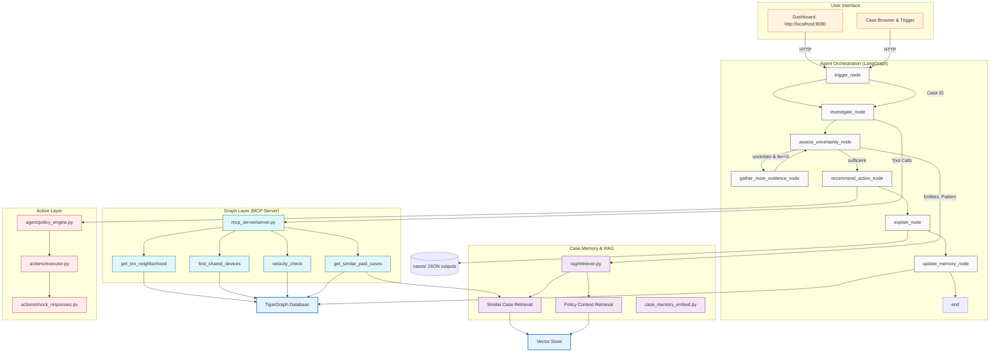

# System Architecture Diagram



## Component Descriptions

### User Interface

- **Dashboard**: Main investigation console showing case status, evidence, and recommendations
- **Case Browser**: Browse historical cases and trigger new investigations

### Agent Orchestration (LangGraph)

- **trigger_node**: Opens case from case_pack.csv or UI
- **investigate_node**: Calls MCP tools to gather evidence
- **assess_uncertainty_node**: Rule-based fraud assessment (pattern, probability, confidence)
- **gather_more_evidence_node**: Requests additional evidence when uncertain
- **recommend_action_node**: Recommends policy-compliant actions
- **explain_node**: Generates human-readable explanations and SAR narratives
- **update_memory_node**: Archives case to graph for future similarity

### Case Memory & RAG

- **Similar Case Retrieval**: Finds historically similar cases for context
- **Policy Context Retrieval**: Retrieves relevant fraud policies
- **Vector Store**: Stores case embeddings for similarity search

### Graph Layer (MCP Server)

- **get_txn_neighborhood**: Transaction details, risk signals, channel info
- **find_shared_devices**: Device clustering and fraud ring detection
- **velocity_check**: Transaction velocity and pattern analysis
- **get_similar_past_cases**: Case memory retrieval

### Action Layer

- **Policy Engine**: Routes actions based on risk level (auto/L1/L2 approval)
- **Executor**: Mock execution of fraud actions (block card, create case, etc.)

### Data Stores

- **TigerGraph**: Primary graph database for relationships and traversals
- **Vector Store**: Embedding store for case similarity search
- **Case Storage**: JSON output files for benchmark results

## Data Flow

1. **Trigger**: Case initiated via UI or benchmark script
2. **Investigate**:
   - MCP tools query TigerGraph for evidence
   - Evidence stored in CaseState
3. **Assess**:
   - Rule-based analysis of evidence
   - Pattern detection and probability calculation
   - If uncertain and iterations < 3 → gather more evidence
4. **Recommend**: Policy-compliant action recommendation
5. **Explain**: Generate narratives and justifications
6. **Update**: Archive case to TigerGraph for future reference

## Key Interfaces

### MCP Server Interface

```python
# Available tools via mcp_server/server.py
- get_txn_neighborhood(txn_id, card_id, customer_id)
- find_shared_devices(card_id, time_window_hours)
- velocity_check(card_id, time_window_minutes)
- get_similar_past_cases(pattern, device_id, card_id)
```

### State Interface

```python
# agent/state.py CaseState contains:
- case_metadata (case_id, card_id, customer_id, etc.)
- investigation_state (status, verdict, probabilities)
- evidence (List[Evidence])
- actions (List[Action])
- explanations (summary, SAR, etc.)
- control_flow (iteration_count, sufficient_evidence)
```

### Action Interface

```python
# actions/executor.py executes:
- BLOCK_CARD
- CREATE_CASE
- FILE_SAR
- VERIFY_WITH_CUSTOMER
- STEP_UP_AUTH
- ESCALATE_TO_ANALYST
- MONITOR_CARD
- CLOSE_NO_FRAUD
```
