# TigerGraph Agentic Fraud Investigation

An autonomous fraud investigation system that uses TigerGraph as the primary reasoning substrate to investigate flagged transactions, assess risk and uncertainty, and recommend next-best-actions within policy constraints.

_Submitted for the TigerGraph Agentic AI Hackathon 2026_

## Overview

This system implements an agentic fraud investigation workflow that:

- Investigates flagged transactions using graph traversal and MCP tools.
- Explicitly handles uncertainty by conditionally requesting additional evidence (Analyst, Customer) when needed.
- Recommends policy-compliant actions with approval routing.
- Maintains case memory for future investigations (embedded and wired natively back to the Graph).
- Generates regulatory filings (SAR narratives).

## Architecture

- **Graph Layer**: TigerGraph (Savanna) with GSQL queries exposing relationships.
- **Agent Orchestration**: LangGraph state machine with 7 explicit investigation nodes.
- **LLM**: Anthropic Claude for synthesis, uncertainty assessment, and contextual explanations.
- **RAG**: Hybrid graph+vector retrieval for policy requirements and case memory.
- **Action Layer**: Mock FastAPI endpoints for fraud actions execution.
- **UI**: FastAPI + Vanilla JS asynchronous triggers and case browser.

## Setup

### Prerequisites

- Python 3.9+
- TigerGraph Savanna account (free tier)
- Anthropic API key (`ANTHROPIC_API_KEY`)

### Installation

1. Clone the repository

```bash
git clone <repo-url>
cd tigergraph-fraud-agent
```

2. Create and activate virtual environment

```bash
python -m venv venv
source venv/bin/activate  # On Windows: venv\Scripts\activate
```

3. Install Python dependencies

```bash
pip install -r requirements.txt
```

4. Configure environment variables

```bash
cp .env.example .env
# Edit .env with your TigerGraph and Anthropic credentials
```

## Usage

### Run Benchmark Cases

```bash
python evaluation/run_benchmark.py
```

This will process all 20 cases in an unattended programmatic loop from `data/raw/case_pack.csv` and output strictly formatted results to the `cases/` directory, exactly matching the benchmark specifications.

### Start UI Dashboard & Run a Single Case

```bash
python ui/main.py
```

Visit `http://localhost:8080/` to view the Case Investigation Console, browse the benchmark results, and manually trigger new LangGraph investigations live.

## Project Structure

```text
├── data/              # Raw data
├── cases/             # Benchmark JSON outputs (20 files)
├── docs/              # Planning documents and architectures
├── graph/             # TigerGraph schema, queries, loading jobs
├── mcp_server/        # MCP tool layer wrapping Graph traversals
├── rag/               # Vector store and hybrid GraphRAG retrievals
├── agent/             # LangGraph state machine & schemas
├── actions/           # Mock action endpoints
├── ui/                # FastAPI triggers console
├── evaluation/        # Benchmark runner
├── submission/        # Assets: demo scripts, blog post, social post
└── scripts/           # Setup and utility scripts
```

## Key Features

### Graph-Native Reasoning

All pattern detection and relationship analysis happens natively querying connected components via MCP endpoints. The LLM synthesizes and structures ambiguous text.

### Uncertainty Handling

The LangGraph conditional edge explicitly represents "insufficient evidence" as a valid state loop. When LLM confidence is below threshold, it routes backwards to simulate requesting additional evidence up to 3 times before taking high-impact action.

### Policy Compliance

A deterministic policy engine intercepts LLM recommendations to flag approval requirements before generating the final timeline.

### Case Memory

Closed cases are modeled and stored in the graph for traversal retrieval (`SIMILAR_TO` edges), and as vectors for contextual RAG matching.

## Architecture

### Core Components

1. **Agent Orchestration** (`agent/`)
   - LangGraph state machine with 7 explicit investigation nodes
   - CaseState as single source of truth
   - Nodes: trigger, investigate, assess_uncertainty, gather_more_evidence, recommend_action, explain, update_memory

2. **Graph Layer** (`mcp_server/`)
   - MCP (Model Context Protocol) server wrapping TigerGraph traversals
   - Mock data generators for demonstration (swapable for real GSQL)
   - Tools: get_txn_neighborhood, find_shared_devices, velocity_check, get_similar_past_cases

3. **RAG System** (`rag/`)
   - Hybrid graph+vector retrieval for policy requirements and case memory
   - Policy context retrieval
   - Similar case retrieval

4. **Action Layer** (`actions/`)
   - Mock action endpoints for fraud actions execution
   - Policy engine for approval routing

5. **UI Dashboard** (`ui/`)
   - FastAPI + Vanilla JS asynchronous triggers and case browser
   - Real-time case investigation console

6. **Evaluation** (`evaluation/`)
   - Benchmark runner for 20 test cases
   - Outputs strictly formatted results matching benchmark specifications

### Data Flow

1. **Trigger** - UI or API opens a case from `case_pack.csv`
2. **Investigate** - MCP tools gather evidence via graph traversals:
   - Transaction neighborhood (risk signals, amount, channel)
   - Shared devices (fraud rings, device sharing)
   - Velocity check (transaction patterns like card testing)
   - Similar past cases (case memory)
3. **Assess Uncertainty** - Rule-based assessment of:
   - Fraud probability (risk_score + signal boosts)
   - Confidence (corroborating signals)
   - Pattern detection (card_testing, device_sharing, etc.)
   - Sufficient evidence threshold
4. **Gather More Evidence** (if uncertain) - Request:
   - Customer validation
   - Step-up authentication
   - Analyst review
5. **Recommend Actions** - Policy-compliant actions:
   - BLOCK_CARD, CREATE_CASE, FILE_SAR, VERIFY_WITH_CUSTOMER, etc.
   - Routing: auto (low risk), L1 (medium), L2 (high)
6. **Explain** - Generate human-readable narrative:
   - Summary for analysts
   - SAR narrative (if required)
   - Evidence explanation
   - Uncertainty explanation
   - Action justification
7. **Update Memory** - Archive case to graph for future similarity search

## Key Features

### Graph-Native Reasoning

All pattern detection and relationship analysis happens via MCP tool calls to TigerGraph. The LLM (when available) synthesizes and structures ambiguous text.

### Uncertainty Handling

LangGraph conditional edge represents "insufficient evidence" as a valid state loop. When confidence < 0.6, system requests additional evidence up to 3 times before taking high-impact action.

### Policy Compliance

Deterministic policy engine intercepts recommendations to flag approval requirements before generating final timeline.

### Case Memory

Closed cases modeled and stored in graph for traversal retrieval (SIMILAR_TO edges) and as vectors for contextual RAG matching.

### Regulatory Filings

Generates SAR narratives for confirmed fraud cases meeting exposure thresholds.

## State Machine

The LangGraph consists of 7 nodes in this sequence:

```
trigger → investigate → assess_uncertainty →
[gather_more_evidence] ← (if uncertain & iteration < 3) →
recommend_action → explain → update_memory → end
```

## Configuration

### Environment Variables

- `ANTHROPIC_API_KEY`: For LLM calls (not required for deterministic mode)
- `ANTHROPIC_BASE_URL`: Set to `http://localhost:20128` for Claude Code proxy
- TigerGraph connection details in `.env`

### Dependencies

- Python 3.9+
- TigerGraph Savanna account
- Required packages: fastapi, uvicorn, pydantic, python-dotenv, anthropic

## Usage

### Run Benchmark Cases

```bash
python evaluation/run_benchmark.py
```

Processes all 20 cases from `data/raw/case_pack.csv` and outputs to `cases/` directory.

### Start UI Dashboard

```bash
python ui/main.py
```

Visit `http://localhost:8080/` to view Case Investigation Console.

## Deterministic Mode (No LLM)

When Anthropic API is unavailable, the system uses rule-based logic in:

- `assess_uncertainty_node`: Calculates fraud probability from risk signals
- `gather_more_evidence_node`: Selects evidence type based on pattern and iteration
- `explain_node`: Generates template-based explanations from state fields

## File Formats

### Input: `data/raw/case_pack.csv`

Columns: case_id, opened_at, trigger_type, trigger_text, flagged_txn_id, card_id, customer_id, risk_score

### Output: `cases/{case_id}.json`

Structured JSON matching benchmark specification with fields:

- case_id, status, verdict, fraud_probability, pattern, etc.
- evidence array with claims, sources, refs
- explanation summary, SAR narrative, recommended actions

## Extending the System

1. **Replace Mock Data**: Implement real GSQL queries in `mcp_server/server.py`
2. **Add New Patterns**: Extend pattern detection in `assess_uncertainty_node`
3. **Modify Policy**: Update policy documents and retrieval in `rag/`
4. **Add Actions**: Implement new action types in `actions/` and policy engine
5. **Enhance UI**: Add new visualization components in `ui/`

## Benchmark Results

After fixes, the system produces varied verdicts:

- Multiple fraud cases (clear patterns)
- Multiple uncertain cases (borderline signals)
- All deterministic, no LLM calls required

# System Architecture Diagram

```mermaid
graph TD

    %% =========================================================
    %% USER INTERFACE
    %% =========================================================
    subgraph UI["🖥️ USER INTERFACE"]
        direction TB
        UI_Dashboard["📊 Dashboard<br/><small>localhost:8080</small>"]
        UI_Case_Browser["🔎 Case Browser<br/>& Trigger"]
    end


    %% =========================================================
    %% AGENT ORCHESTRATION
    %% =========================================================
    subgraph Agent["🤖 AGENT ORCHESTRATION · LANGGRAPH"]
        direction LR

        Trigger(["⚡ trigger_node"])
        Investigate(["🔍 investigate_node"])
        Assess{"❓ assess_uncertainty_node"}
        Gather(["📚 gather_more_evidence_node"])
        Recommend(["🎯 recommend_action_node"])
        Explain(["💡 explain_node"])
        Update(["🧠 update_memory_node"])
        End(["✓ END"])

        Trigger --> Investigate
        Investigate --> Assess

        Assess -->|"Uncertain<br/>& iter < 3"| Gather
        Gather --> Assess

        Assess -->|"Sufficient"| Recommend
        Recommend --> Explain
        Explain --> Update
        Update --> End
    end


    %% =========================================================
    %% MEMORY & RAG
    %% =========================================================
    subgraph Memory["🧠 CASE MEMORY & RAG"]
        direction TB

        RAG["🔗 RAG Retriever<br/><small>rag/retriever.py</small>"]
        Similar["🔎 Similar Case<br/>Retrieval"]
        Policy["📜 Policy Context<br/>Retrieval"]
        Embed["🧬 Case Memory<br/>Embeddings"]
    end


    %% =========================================================
    %% GRAPH / MCP
    %% =========================================================
    subgraph Graph["🕸️ GRAPH INTELLIGENCE · MCP SERVER"]
        direction TB

        MCP["🔌 MCP Server<br/><small>mcp_server/server.py</small>"]

        TxN["🧩 Transaction<br/>Neighborhood"]
        Dev["🔗 Shared Device<br/>Detection"]
        Vel["⚡ Velocity<br/>Check"]
        Sim["🔎 Similar Past<br/>Cases"]

        MCP --> TxN
        MCP --> Dev
        MCP --> Vel
        MCP --> Sim
    end


    %% =========================================================
    %% ACTION LAYER
    %% =========================================================
    subgraph Actions["⚙️ ACTION & DECISION LAYER"]
        direction TB

        Policy_Engine["🛡️ Policy Engine<br/><small>agent/policy_engine.py</small>"]
        Executor["🚀 Action Executor<br/><small>actions/executor.py</small>"]
        Mock["🧪 Mock Responses<br/><small>actions/mock_responses.py</small>"]

        Policy_Engine --> Executor
        Executor --> Mock
    end


    %% =========================================================
    %% DATA STORES
    %% =========================================================
    TigerGraph[("🗄️ TigerGraph<br/>Database")]
    VectorDB[("🔮 Vector Store")]
    Case_Storage[("📁 Case Storage<br/>JSON Outputs")]


    %% =========================================================
    %% UI → AGENT
    %% =========================================================
    UI_Dashboard -->|"HTTP"| Trigger
    UI_Case_Browser -->|"HTTP"| Trigger


    %% =========================================================
    %% AGENT → GRAPH
    %% =========================================================
    Investigate -->|"Tool Calls"| MCP

    TxN --> TigerGraph
    Dev --> TigerGraph
    Vel --> TigerGraph
    Sim --> TigerGraph


    %% =========================================================
    %% GRAPH → MEMORY
    %% =========================================================
    Sim --> Similar
    Similar --> VectorDB
    Policy --> VectorDB
    Embed --> VectorDB


    %% =========================================================
    %% AGENT → RAG
    %% =========================================================
    Assess -->|"Entities + Pattern"| RAG
    RAG --> Similar
    RAG --> Policy


    %% =========================================================
    %% DECISION → ACTION
    %% =========================================================
    Recommend --> Policy_Engine


    %% =========================================================
    %% EXPLANATION / MEMORY
    %% =========================================================
    Explain --> Case_Storage
    Update -->|"Persist Case Knowledge"| TigerGraph


    %% =========================================================
    %% STYLING
    %% =========================================================

    %% UI
    classDef ui fill:#E8F1FF,stroke:#2563EB,color:#172554,stroke-width:2px;

    %% Agent
    classDef agent fill:#EAF8F0,stroke:#16A34A,color:#14532D,stroke-width:2px;

    %% Decision
    classDef decision fill:#FFF7D6,stroke:#D97706,color:#78350F,stroke-width:2px;

    %% Memory
    classDef memory fill:#F3E8FF,stroke:#9333EA,color:#581C87,stroke-width:2px;

    %% Graph
    classDef Graph fill:#E6FFFB,stroke:#0891B2,color:#164E63,stroke-width:2px;

    %% Actions
    classDef action fill:#FFF0F0,stroke:#DC2626,color:#7F1D1D,stroke-width:2px;

    %% Database
    classDef database fill:#EEF2F7,stroke:#475569,color:#0F172A,stroke-width:2px;

    %% End
    classDef endA fill:#DCFCE7,stroke:#15803D,color:#14532D,stroke-width:2px;

    %% Apply classes
    class UI_Dashboard,UI_Case_Browser ui;

    class Trigger,Investigate,Gather,Recommend,Explain,Update agent;
    class Assess decision;
    class End endA;

    class RAG,Similar,Policy,Embed memory;

    class MCP,TxN,Dev,Vel,Sim Graph;

    class Policy_Engine,Executor,Mock action;

    class TigerGraph,VectorDB,Case_Storage database;


    %% =========================================================
    %% SUBGRAPH STYLING
    %% =========================================================

    style UI fill:#F8FBFF,stroke:#2563EB,stroke-width:2px
    style Agent fill:#F7FCF8,stroke:#16A34A,stroke-width:2px
    style Memory fill:#FCF8FF,stroke:#9333EA,stroke-width:2px
    style Graph fill:#F4FEFF,stroke:#0891B2,stroke-width:2px
    style Actions fill:#FFF8F8,stroke:#DC2626,stroke-width:2px
```



## Component Descriptions

### User Interface

- **Dashboard**: Main investigation console showing case status, evidence, and recommendations
- **Case Browser**: Browse historical cases and trigger new investigations

### Agent Orchestration (LangGraph)

- **trigger_node**: Opens case from case_pack.csv or UI
- **investigate_node**: Calls MCP tools to gather evidence
- **assess_uncertainty_node**: Rule-based fraud assessment (pattern, probability, confidence)
- **gather_more_evidence_node**: Requests additional evidence when uncertain
- **recommend_action_node**: Recommends policy-compliant actions
- **explain_node**: Generates human-readable explanations and SAR narratives
- **update_memory_node**: Archives case to graph for future similarity

### Case Memory & RAG

- **Similar Case Retrieval**: Finds historically similar cases for context
- **Policy Context Retrieval**: Retrieves relevant fraud policies
- **Vector Store**: Stores case embeddings for similarity search

### Graph Layer (MCP Server)

- **get_txn_neighborhood**: Transaction details, risk signals, channel info
- **find_shared_devices**: Device clustering and fraud ring detection
- **velocity_check**: Transaction velocity and pattern analysis
- **get_similar_past_cases**: Case memory retrieval

### Action Layer

- **Policy Engine**: Routes actions based on risk level (auto/L1/L2 approval)
- **Executor**: Mock execution of fraud actions (block card, create case, etc.)

### Data Stores

- **TigerGraph**: Primary graph database for relationships and traversals
- **Vector Store**: Embedding store for case similarity search
- **Case Storage**: JSON output files for benchmark results

## Data Flow

1. **Trigger**: Case initiated via UI or benchmark script
2. **Investigate**:
   - MCP tools query TigerGraph for evidence
   - Evidence stored in CaseState
3. **Assess**:
   - Rule-based analysis of evidence
   - Pattern detection and probability calculation
   - If uncertain and iterations < 3 → gather more evidence
4. **Recommend**: Policy-compliant action recommendation
5. **Explain**: Generate narratives and justifications
6. **Update**: Archive case to TigerGraph for future reference

## Key Interfaces

### MCP Server Interface

```python
# Available tools via mcp_server/server.py
- get_txn_neighborhood(txn_id, card_id, customer_id)
- find_shared_devices(card_id, time_window_hours)
- velocity_check(card_id, time_window_minutes)
- get_similar_past_cases(pattern, device_id, card_id)
```

### State Interface

```python
# agent/state.py CaseState contains:
- case_metadata (case_id, card_id, customer_id, etc.)
- investigation_state (status, verdict, probabilities)
- evidence (List[Evidence])
- actions (List[Action])
- explanations (summary, SAR, etc.)
- control_flow (iteration_count, sufficient_evidence)
```

### Action Interface

```python
# actions/executor.py executes:
- BLOCK_CARD
- CREATE_CASE
- FILE_SAR
- VERIFY_WITH_CUSTOMER
- STEP_UP_AUTH
- ESCALATE_TO_ANALYST
- MONITOR_CARD
- CLOSE_NO_FRAUD
```
